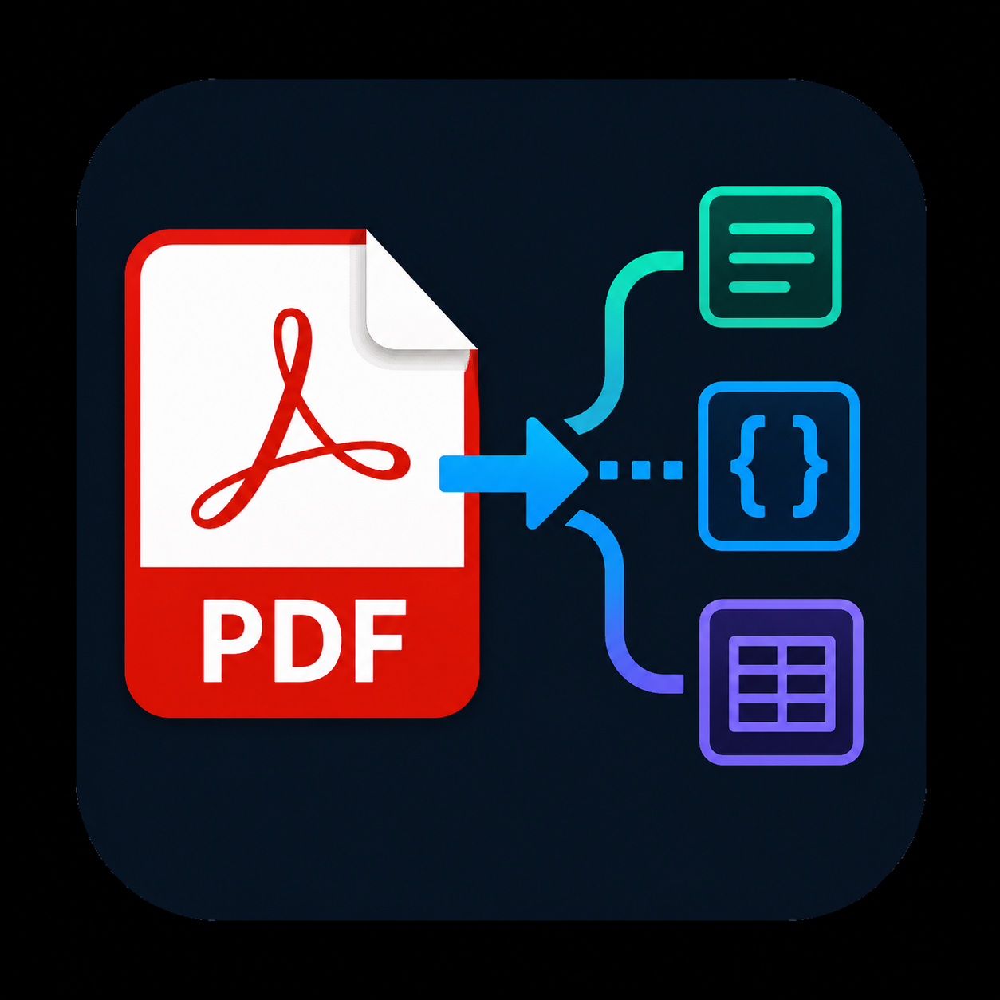

# PDF Extractor

Extract text from PDF files directly in VS Code.

`PDF Extractor` adds a context menu action in the Explorer so you can right-click a PDF and open its extracted text in a new editor tab.

## Features

- Right-click any `.pdf` file in the Explorer and run **Extract Text from PDF**
- Opens extracted content in a new plain text editor tab
- Shows clear error/warning messages when extraction fails or no text is found
- Supports both `.pdf` and `.PDF` file extensions

## How To Use

1. Open a folder in VS Code that contains PDF files.
2. In the Explorer, right-click a PDF file.
3. Select **Extract Text from PDF**.
4. View the extracted text in the new tab.

## Command

- **Command ID:** `pdfExtractor.extract`
- **Command Title:** `Extract Text from PDF`

## Requirements

- VS Code `^1.116.0`

No additional setup is required for users after installing the extension.

## Known Limitations

- Scanned/image-only PDFs may return little or no text.
- Complex PDFs (columns, tables, mixed layout) may produce imperfect text order.
- Large PDFs may take longer to process.

## Release Notes

### 0.0.1

- Initial release
- Added Explorer context menu command to extract text from PDF files
- Added error handling for invalid files and extraction failures
